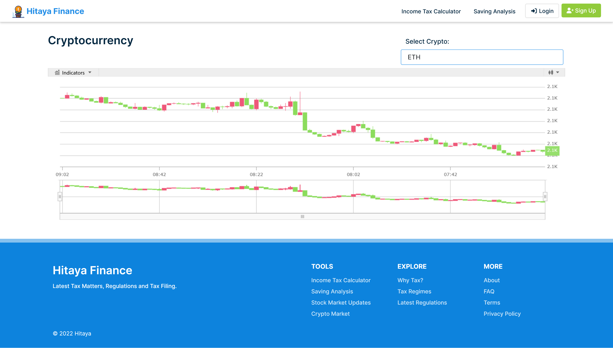

# Hitaya Finance


### 1. Run the .NET Backend Application

```
$ git clone https://github.com/IntelegixLabs/Hitaya_Finance
$ cd Hitaya_Finance\Hitaya_Finance\Hitaya_Finance
$ dotnet clean
$ dotnet build Hitaya_Finance.sln
$ cd Hitaya_Finance.ServiceLayer
$ dotnet watch run --Hitaya_Finance.ServiceLayer
```

### 2. Run the Angular App

```
$ git clone https://github.com/IntelegixLabs/Hitaya_Finance
$ cd Hitaya_Finance
$ cd HitayaApp
$ npm install
$ ng serve
```

### 3. High Level Architecture of Hitaya_Finance

<p align="center">
  
</p>

### 4. Hitaya_Finance Runtime Screenshots

<br />
<p align="center">
	
  
  
  
  
  
  
  
  
  
  
  
  
  
	
</p>
<br />

