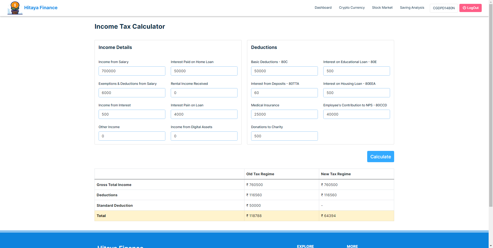
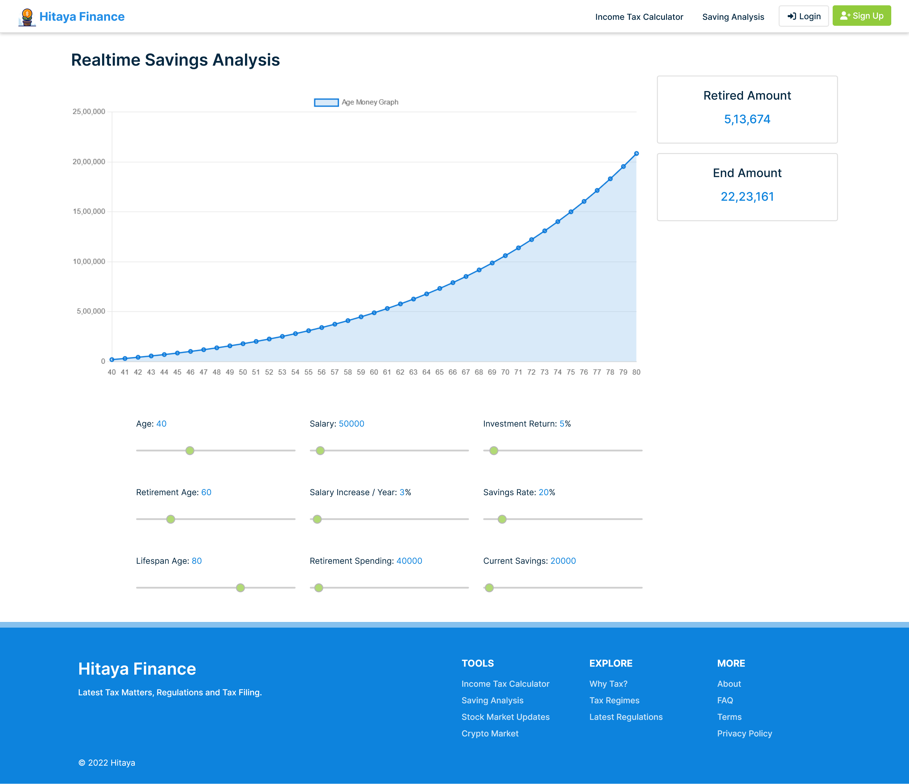

<h1 align="center">HITAYA FINANCE</h1>

	
<strong>Hitaya Finance </strong>support taxpayers to understand crucial information about taxation, ensures proper tax filing procedures, encourages an individual to pay taxes and provide updated news about current union budget and taxation updates.

Contains everything related to tax, clears the fog and prevent confusions between tax regimes and helps an taxpayee to understand which one is best for him/her.

It also aimed to first time taxpayers to get started easily.

<strong>Tax Calculator.</strong> Suggestion on which regime is best for a taxpayer based on current salary, expenses, income, deductions, etc. Get your detailed calculated tax info. Tables generated describes tax benefit details. Even one can download PDF of it. User Interface even a child can understand in just 10 seconds. All the data are stored so in future, one can see his/her tax info. Clears the clutters of tax filing issues. Loads of information to make it easy for beginners.
	


### 1. Run the .NET Backend Application

```
$ git clone https://github.com/IntelegixLabs/Hitaya_Finance
$ cd Hitaya_Finance\Hitaya_Finance\Hitaya_Finance
$ dotnet clean
$ dotnet build Hitaya_Finance.sln
$ cd Hitaya_Finance.ServiceLayer
$ dotnet watch run --Hitaya_Finance.ServiceLayer
```

### 2. Run the Angular App

```
$ git clone https://github.com/IntelegixLabs/Hitaya_Finance
$ cd Hitaya_Finance
$ cd HitayaApp
$ npm install
$ ng serve
```

### 3. High Level Architecture of Hitaya_Finance

<p align="center">
  
</p>

### 4. Hitaya Finance Runtime Screenshots

<br />
<p align="center">
  
  
  
  
  
  
  
  
  
  
  
  
  
  
  
	
</p>
<br />

